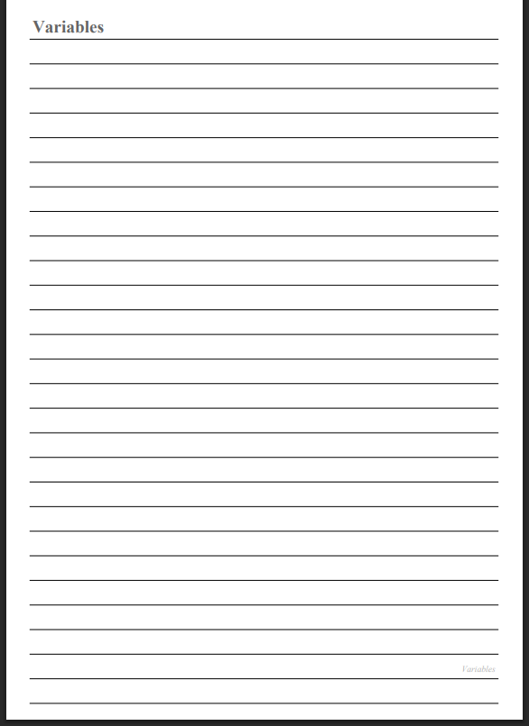

# PDF Generator App

A simple Python script that generates a multi-page PDF report from a CSV file. Each row in the CSV becomes a topic section, optionally spanning multiple pages, with a styled title and footer.

## Features

- Reads topic data from a CSV file
- Generates one or more PDF pages per topic
- Custom fonts, colors, and footer styling
- Built with [fpdf2](https://pypi.org/project/fpdf2/) and [pandas](https://pandas.pydata.org/)

## Requirements

- Python 3.10+
- See `requirements.txt` for dependencies

## Setup

1. Clone the repository:
   ```
   git clone https://github.com/NuralNv/pdf-generator-app.git
   cd pdf-generator-app
   ```

2. Install dependencies:
   ```
   pip install -r requirements.txt
   ```

## Usage

1. Create a `topics.csv` file in the project folder with the following format:

   | Order | Topic     | Pages |
   |-------|-----------|-------|
   | 1     | Variables | 2     |
   | 2     | Lists     | 3     |

   - **Order**: sequence number for the topic
   - **Topic**: title text to display on the page
   - **Pages**: number of pages to generate for that topic

2. Run the script:
   ```
   python main.py
   ```

3. The generated PDF will be saved as `output.pdf` in the project folder.

## Example Output

## Notes

- `output.pdf` is generated locally and is not tracked in this repository (see `.gitignore`).
- `topics.csv` should be created or modified by the user based on the format above.

## License

This project is open source and available under the MIT License.
